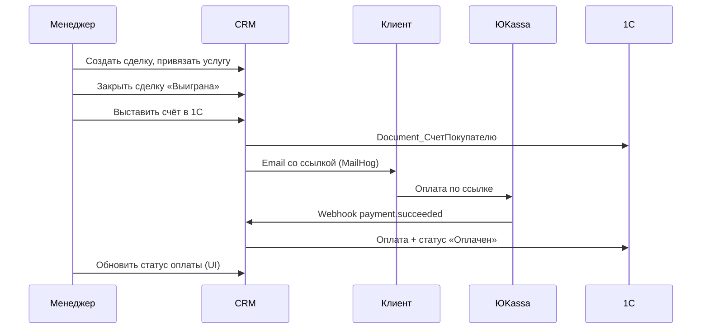

# Демонстрация CRM: контрольные сценарии

Документ для защиты проекта, показа заказчику или проверки, что система работает end-to-end.

---

## 1. Что показываем

CRM для B2B-продаж: контакты, услуги, сделки, задачи, маркетинг, документы, чат, заявки с почты и **оплата через ЮKassa с выставлением счёта в 1С**.

| Роль | URL после входа | Назначение |
|------|-----------------|------------|
| **Менеджер / админ** | http://localhost:3000/manager/dashboard | Ведение воронки, счета, коммуникации |
| **Клиент** | http://localhost:3000/client/dashboard | Свои сделки и услуги |

**Инфраструктура (Docker):**

```bash
docker compose up -d --build
```

| Сервис | Порт | Назначение |
|--------|------|------------|
| Frontend | 3000 | Интерфейс |
| API Gateway | 8000 | Единый API `/api/...` |
| Contact | 8005 | Контакты, сделки, услуги |
| Payments | 8012 | Счета, ЮKassa, синхронизация 1С |
| MailHog | 8025 | Просмотр писем (ссылка на оплату) |
| 1С OData | localhost/1c/... | Учёт (вне Docker, на хосте) |

---

## 2. Подготовка к демо (15 минут)

### 2.1. Запуск

```bash
docker compose up -d --build
```

Убедиться, что подняты: `api-gateway`, `contact-service`, `payments`, `frontend`, `mailhog`.

### 2.2. Тестовые пользователи

Создать через регистрацию или админку (`/manager/users`):

- **Менеджер** — основной ведущий демо.
- **Клиент** (роль `client`) — для сценария личного кабинета (опционально).

### 2.3. Справочники в CRM

1. **Услуги** — `/manager/services`  
   Пример: «Консультация», цена 10 000 ₽.

2. **Контакт** — `/manager/contacts`  
   Имя, email (обязателен для ссылки на оплату), телефон.

3. **1С** — в справочнике `Catalog_Услуги` желательно услуга с **тем же названием**, что в CRM (привязка по имени, как в ручном скрипте `create_invoice_interactive.py`).

### 2.4. Проверка связи с 1С

- OData доступен: `http://localhost/1c/odata/standard.odata/`
- В `docker-compose` для `payments`: `host.docker.internal` → 1С на машине демонстратора.

---

## 3. Сквозной сценарий (главный, ~10 мин)

**История:** клиент оставил заявку → менеджер ведёт сделку → выигрыш → счёт в 1С → оплата → статусы в CRM и 1С.



### Шаги

| № | Действие | Где | Ожидаемый результат |
|---|----------|-----|---------------------|
| 1 | Создать сделку: контакт + услуга + сумма | `/manager/deals` → новая сделка | Сделка в статусе «В работе» |
| 2 | Перевести в канбане или в карточке | `/manager/deals-kanban` или `/manager/deals/:id` | Этап меняется, видна история |
| 3 | Нажать **«Выиграть сделку»** | Карточка сделки | Статус `won` |
| 4 | **«Выставить счет в 1С»** | Блок «Счет и оплата» | Синхронизация 1С: «Готово», GUID счёта, услуга из CRM |
| 5 | Открыть MailHog | http://localhost:8025 | Письмо со ссылкой `/payment/pay/{id}/` |
| 6 | Перейти по ссылке, оплатить (тест ЮKassa) | Браузер клиента | Редирект на страницу успеха |
| 7 | **«Обновить статус оплаты»** | Карточка сделки | Статус счёта: **Оплачен** |
| 8 | Проверить 1С | Документ счёта | Статус «Оплачен», верная услуга в составе |

**Что проговорить на защите:** данные счетов хранятся в `databases/payments.db` (volume), пересборка Docker не стирает оплаты; повторное нажатие «Выставить счёт» не плодит дубликаты в 1С, если счёт уже синхронизирован.

---

## 4. Сценарии по модулям

### Сценарий A — Воронка продаж

**Цель:** показать работу менеджера с лидами.

1. Список сделок с фильтрами — `/manager/deals`.
2. Канбан по этапам — `/manager/deals-kanban` (drag-and-drop статуса).
3. Карточка сделки — `/manager/deals/:id`: контакт, услуга, сумма, история (audit trail).
4. Аналитика — `/manager/analytics` (сводка по сделкам/услугам).

**Критерий успеха:** сделка создана, этап изменён, в истории видно кто и когда менял статус.

---

### Сценарий B — Контакт и документы

**Цель:** единая карточка клиента.

1. Список контактов — `/manager/contacts`.
2. Карточка — `/manager/contacts/:id`: сделки контакта, реквизиты (ИНН → подгрузка данных компании, если настроено).
3. Документы — `/manager/documents`: загрузка файла в MinIO, привязка к контакту.

**Критерий успеха:** файл загружен, скачивается, отображается в списке документов контакта.

---

### Сценарий C — Заявки с почты

**Цель:** входящий лид без ручного ввода.

1. Настроен ящик / синхронизация (сервис applications).
2. `/manager/applications` — **«Забрать из почты»**.
3. Одобрить заявку → создаётся контакт и сделка.

**Критерий успеха:** из письма появилась сделка с привязанным контактом.

---

### Сценарий D — Маркетинг

**Цель:** коммуникация с клиентской базой.

1. `/manager/marketing` — шаблон письма с переменными `{name}`, `{company}`.
2. Отправка одному контакту или мини-кампания.
3. Письмо в MailHog.

**Критерий успеха:** статус отправки в CRM, письмо в MailHog с подставленными полями.

---

### Сценарий E — Задачи и календарь

**Цель:** планирование работы менеджера.

1. `/manager/calendar` — создать задачу, срок, привязка к сделке (если есть в форме).
2. Отметить выполненной, посмотреть просроченные / на сегодня.

**Критерий успеха:** задача отображается в нужном дне, статус «выполнена» сохраняется.

---

### Сценарий F — Чат (Telegram-бот)

**Цель:** omnichannel.

1. `/manager/chats` — комната с клиентом, ответ менеджера.
2. (Опционально) сообщение из Telegram → появляется в CRM.

**Критерий успеха:** переписка в одном окне, без потери сообщений при обновлении.

---

### Сценарий G — Личный кабинет клиента

**Цель:** роль `client`.

1. Войти как клиент.
2. `/client/deals` — видны только свои сделки.
3. `/client/services` — каталог услуг, заявка на услугу (если включено).

**Критерий успеха:** клиент не видит чужие данные и разделы менеджера.

---

### Сценарий H — Оплата и 1С (углублённо)

**Цель:** показать интеграции payments + 1С + ЮKassa.

| Проверка | Как |
|----------|-----|
| Счёт создан в 1С | В карточке сделки: «Контрагент 1С» = GUID, услуга совпадает с CRM |
| Ссылка на оплату | MailHog или поле `payment_url` в API |
| Оплата прошла | Webhook + статус `paid` в CRM |
| Статус в 1С | «Оплачен» (PATCH после документа оплаты) |
| Ошибка синхронизации | Кнопка **«Повторить синхронизацию с 1С»** (без дубля оплаты, если уже оплачено) |
| Обновление UI | **«Обновить статус оплаты»** — подтягивание из ЮKassa без перелогина |

**Логи при сбое:**

```bash
docker compose logs -f payments
```

---

## 5. Контрольный чек-лист перед показом

- [ ] `docker compose ps` — все нужные контейнеры `Up`
- [ ] Вход менеджера работает
- [ ] Есть минимум 1 услуга и 1 контакт с email
- [ ] 1С OData отвечает, в справочнике услуга с именем как в CRM
- [ ] MailHog открывается (8025)
- [ ] Тестовая оплата ЮKassa (test shop) проходит
- [ ] После оплаты: «Обновить статус оплаты» → **Оплачен**
- [ ] Перезагрузка страницы сделки — счёт **не** предлагает выставить заново (данные в `databases/payments.db`)

---

## 6. Типичные вопросы на защите (краткие ответы)

| Вопрос | Ответ |
|--------|--------|
| Почему микросервисы? | Независимое развитие доменов (контакты, платежи, маркетинг), единая точка входа — API Gateway |
| Где хранятся данные? | SQLite в `./databases/` (volume Docker) |
| Как безопасность? | JWT, роли manager / admin / client, разделение маршрутов во Vue |
| Что если 1С недоступна? | Счёт в CRM не переводится в «Оплачен» до успешной фиксации в 1С; есть retry |
| Зачем MailHog? | Демо email без реального SMTP |

---

## 7. Минимальный набор для «быстрой» демо (5 минут)

Только сквозной сценарий (раздел 3): одна сделка → выигрыш → счёт → письмо в MailHog → оплата → обновление статуса → показать 1С.

Остальные модули — одним слайдом: «также реализованы: канбан, маркетинг, календарь, документы, заявки, чат, кабинет клиента».

---

*Файл можно приложить к отчёту по практике / диплому как приложение «Руководство по демонстрации».*
